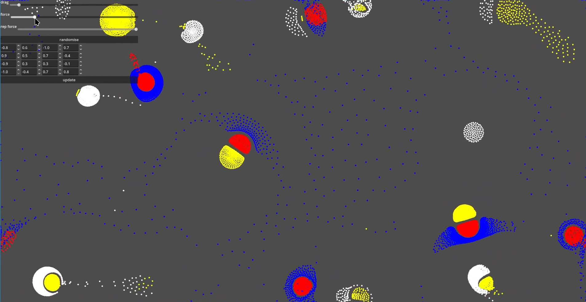

# Particle life - a game of life like simutation written in godot.
A simple gpu accelerated particle simulation.




### Simple explanation:
We have particles.  
They attract or repel.  
The rules are written in the 2d table(in program those are -1 to 1).  

```
	  red   	green  
red	  attract	repel  
green repel		ignore
```

If particles are too close then apply a repultion force.


